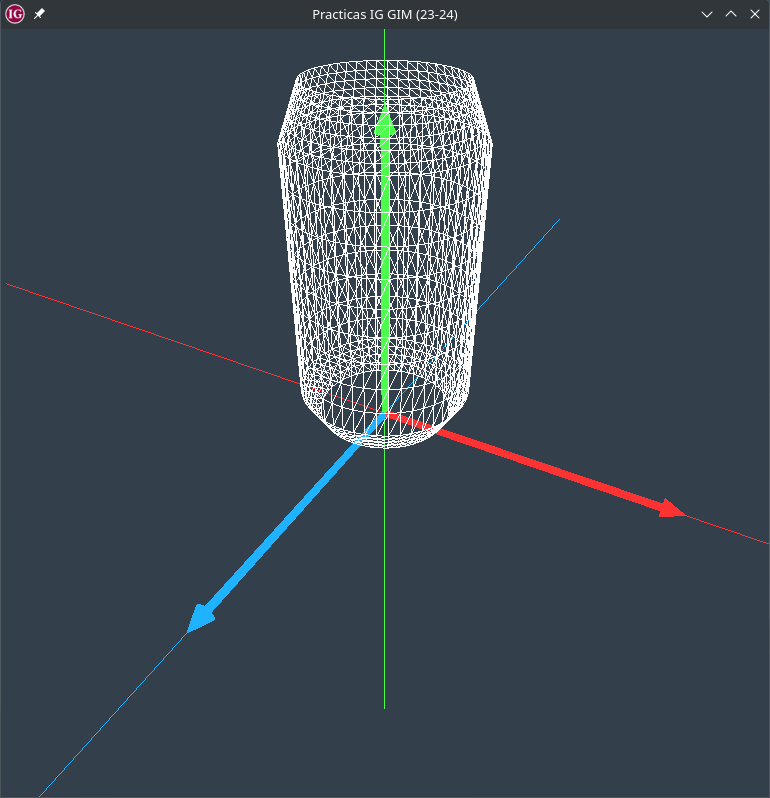

# DGIIM IG Practices 1, 2 and 3

Practice 1, 2 and 3 of the Informática Gráfica (Computer Graphics) course in the Double Degree in Computer Engineering and Mathematics at the University of Granada (2023-2024 academic year).

The objective of these practices is to model different 3D models and scenes using OpenGL.

## How to run it

In GNU/Linux:

* Install dependencies:
    * In Debian/Ubuntu: `sudo apt install g++ cmake libglew-dev libglfw3-dev libglm-dev libjpeg-dev`
* Move to the appropriate folder to run the following commands: `cd ./builds/linux/cmake`
* Clear older files: `rm -r *`
* `cmake ..`
* `make; ../bin/debug_exe`

Shortcuts within the application:
* Change scene: `p`
* Change object within the scene: `o`
* Enable animations: `a`+`+`
* Disable animations: `a`+`-`
* Rotate object: Keyboard arrows or move the mouse pressing right click.

## Code developed by the student

A large part of the code in the `./src` folder has been developed by the student.
